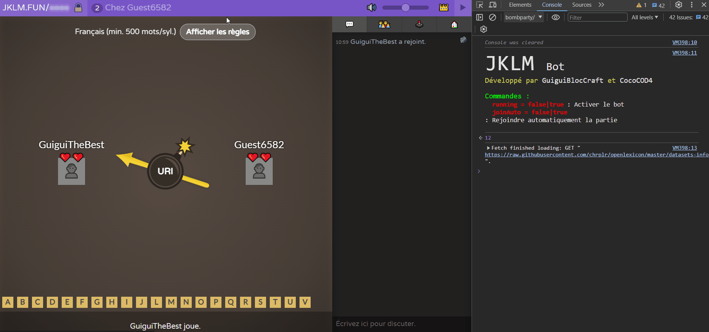

# Bomb Party Bot



Bot non-officiel pour **Bomb Party** de [JKLM.fun](https://jklm.fun/) permet de jouer en simulant le comportement d'un humain.


## Mise en place

Pour mettre en place le bot dans la partie, il faut injecter le code JavaScript dans la console de votre navigateur (`F12` ou `Ctrl + Shift + I`).

Ou copier ce code pour avoir la toute dernière version du bot.

```javascript
fetch("https://raw.githubusercontent.com/GuiguiBlocCraft/bomb-party-bot/main/bombparty.js").then(a=>a.text()).then(a=>eval(a))
```

**ATTENTION :** L'environnement JavaScript doit être dans `bombparty` situé dans `top` (Chrome) ou `En haut` (Firefox) pour que les variables soient correctement utilisées.


## Fonctionnalités

Variables pour paramétrer le bot :

- **running** : Fonctionnement du bot (doit être `true` ou `false` *(par défaut : `true`)*)
- **joinAuto** : Rejoindre automatiquement la partie après que celle-ci est finie (doit être `true` ou `false` *(par défaut : `true`)*)